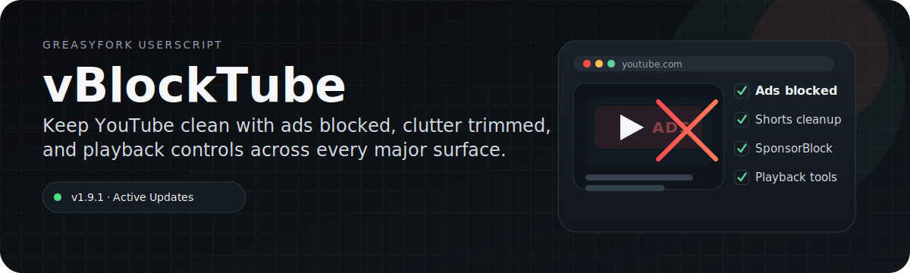

  

  

## Overview

vBlockTube is a YouTube cleanup userscript for people who want the platform to stay usable, not redesigned. It strips out ads and friction across the surfaces you actually hit, then leaves a lighter player behind.

## What it covers

- Ads blocked for standard playback, popups, premium trials, and sponsored clutter.
- YouTube Music ✓ YouTube Kids ✓ YouTube Shorts ✓
- Playback helpers for Shorts scrolling, quality presets, speed presets, and download-related utilities.
- Watch-page cleanup for clutter, recommendations, and configurable button visibility.

## Why it feels native

- The script runs at document start and targets YouTube, mobile YouTube, Music, and Kids directly.
- SponsorBlock and playback toggles live alongside the cleanup features instead of being bolted on later.

## Hotkeys

Use these search-bar triggers inside YouTube to open script controls:

- `2333` opens the configuration dialog.
- `2444` shows the current script settings.
- `2555` resets configuration to defaults.
- `2666` toggles watch-page element visibility.

## Install

1. Install a userscript manager like Tampermonkey or Greasemonkey.
2. Open the script from GreasyFork and install it through your manager.
3. Refresh YouTube and verify that ads and extra clutter are removed.

## Notes

- Avoid running other YouTube ad blockers or overlapping userscripts at the same time.
- If playback breaks, disable conflicting extensions first.

## Contributing

Issues and pull requests are welcome if you find bugs or want to improve behavior on a specific YouTube surface.

## License

See [LICENSE](LICENSE) for details.

