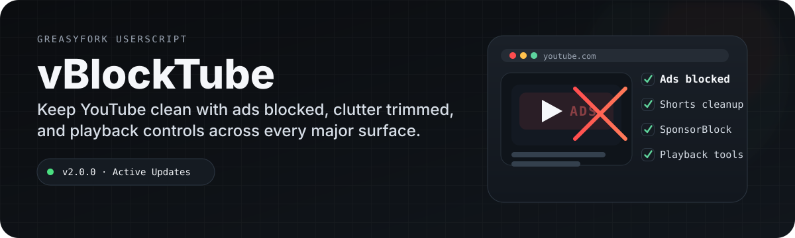

  

  

## Overview

vBlockTube is a YouTube cleanup userscript for people who want the platform to stay usable, not redesigned. It strips out ads and friction across the surfaces you actually hit, then gives you one settings panel to tune everything else.

Works on **YouTube**, **mobile YouTube**, **YouTube Music**, **YouTube Kids** and **Shorts**.

## Highlights

- **Ad blocking** for standard playback, popups, premium trials and sponsored clutter, with no blank gaps left behind.
- **One settings panel** with General, Watch Page, Player and Advanced tabs, a light and dark theme, and a gear button in header.
- **Separate YouTube Music panel** with its own gear button and music-specific options.
- **SponsorBlock built in**, with per-category control.
- **Return YouTube Dislike** counts shown next to the dislike button.
- **Layout control**: 3, 4 or 5 videos per row, full video titles, and a hide switch for most watch-page buttons.
- **Player helpers**: default quality and speed, next and previous buttons restored, red progress bar, and more.

## Settings Panel Details

| Tab | What it covers |
| --- | --- |
| **General** | Dark mode, saturated hover and play-on-hover switches, videos per row, full titles, hiding channel avatars, views, thumbnail badges and the microphone icon, recommendation shelves (Shorts, Live, Movies, Trending, Playables), and all Shorts options. |
| **Watch Page** | Hide Ask, Download, Share, Thanks, Clip, Save, More, Subscribe, Join and the like/dislike bar. Hide AI summaries and the live chat replay teaser. Restore the related sidebar layout. |
| **Player** | Default quality and speed, SponsorBlock and its categories, old player UI, red progress bar, next and previous buttons, and hiding end cards, fullscreen controls and the paid promotion overlay. |
| **Advanced** | Export and import settings, reset to defaults, plus version, status and a copyable diagnostics report for bug reports. |
| **Music** *(YouTube Music only)* | SponsorBlock and repeated-song skipping. The Music panel shows this tab and Advanced instead of the YouTube tabs. |

## Install

1. Install a userscript manager such as [Tampermonkey](https://www.tampermonkey.net/), [Violentmonkey](https://violentmonkey.github.io/) or Greasemonkey.
2. Install the script from [Greasy Fork](https://greasyfork.org/en/scripts/557720-vblocktube) or with the install button above. Your manager will ask you to confirm.
3. Refresh YouTube. The gear button appears in the header, and ads and clutter are already gone.

Updates are delivered through your userscript manager.

## Backup and reset

Under **Advanced** you can export your settings to a `.vbt` file and import them on another browser or after a reinstall. **Reset all settings** restores the defaults. Importing keeps your login-related state and reloads the page.

## Privacy and network requests

vBlockTube runs locally in your browser and has no server of its own. These are the only outside services it talks to:

| Service | Used for |
| --- | --- |
| `api.sponsor.ajay.app` | SponsorBlock segment lookups for the video you are watching |
| `returnyoutubedislikeapi.com` | Estimated dislike counts, using the video ID |
| `update.greasyfork.org` | Checking for new script versions |

## Notes

- Avoid running other YouTube ad blockers or overlapping userscripts at the same time.
- If playback breaks, disable conflicting extensions first, then open **Settings → Advanced → Diagnostics report** and copy the report into an issue.
- Settings that only apply to the desktop layout have no effect on mobile.

## Credits

- [SponsorBlock](https://sponsor.ajay.app) for the segment data.
- [Return YouTube Dislike](https://returnyoutubedislike.com) for the dislike estimates.

## Contributing

Issues and pull requests are welcome if you find bugs or want to improve behavior on a specific YouTube surface. When reporting a problem, include the diagnostics report from the settings panel.

## License

See [LICENSE](https://github.com/vippium/vBlockTube/blob/main/LICENSE) for details.